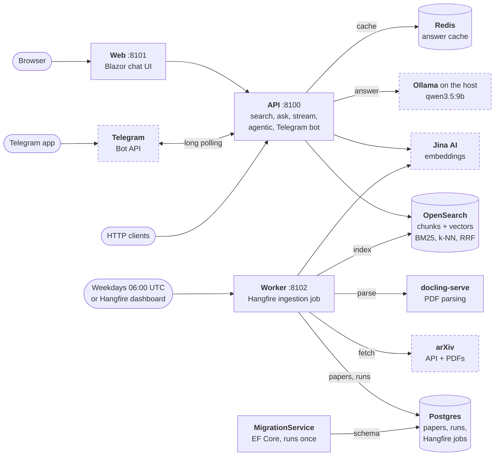
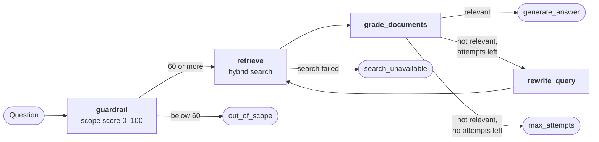

# PaperPilot

[](https://github.com/arunmariappan/PaperPilot/actions/workflows/ci.yml)


[](LICENSE)

An arXiv paper curator built on .NET 10 and Aspire 13. Every weekday it fetches new cs.AI papers from arXiv, parses
their PDFs and indexes them. You can then search them (BM25 plus vectors, fused with reciprocal rank fusion) and ask
questions answered from them by a local Ollama model, either with classic RAG or with an agent that checks the
question is in scope, grades what it finds and rewrites the query when it needs to.

- **API** (`/api/v1`): hybrid search, ask, streaming ask, agentic ask, feedback, models, health.
- **Chat UI** (Blazor): streams answers, or runs the agent and shows its reasoning steps, with sources and feedback.
- **Telegram bot** (optional): questions, `/search` and `/agent` from your phone.
- **Ingestion** (Hangfire): a daily job, plus manual runs and backfills.
- **Tracing**: OpenTelemetry in the Aspire dashboard, and Langfuse (optional) with feedback scores.

It replaces an earlier Python version of the same system, keeping its API, with that version's bugs fixed and every
difference listed. If you're building RAG or agents in .NET, it's a complete, tested example: one command starts all
eight services, and the [engineering notes](#engineering-notes) list what wasn't obvious.

## Stack

| Concern | Choice |
|---|---|
| Runtime | .NET 10, C# 14 |
| Orchestration | Aspire 13 AppHost (containers, projects, secrets, ports) |
| API | ASP.NET Core minimal APIs, OpenAPI with Scalar |
| LLM | Ollama on the host (`qwen3.5:9b`), through OllamaSharp as a Microsoft.Extensions.AI `IChatClient` |
| Agent | Microsoft Agent Framework Workflows |
| Search | OpenSearch 2.19: BM25, k-NN and its RRF search pipeline |
| Embeddings | Jina AI `jina-embeddings-v3` |
| PDF parsing | docling-serve (container), PdfPig for page counts |
| Database | Postgres 18 with EF Core 10 and Npgsql |
| Cache | Redis (exact-match answers, 6 hours) |
| Jobs | Hangfire on Postgres |
| UI | Blazor Web App (Interactive Server), Markdig |
| Bot | Telegram.Bot, long polling |
| Telemetry | OpenTelemetry to the Aspire dashboard, and to Langfuse over OTLP (no SDK) |
| Tests | xUnit v3 on Microsoft.Testing.Platform, Shouldly, WireMock.Net, Testcontainers, bUnit, Aspire.Hosting.Testing |

## Architecture



The Aspire AppHost starts the solid boxes: the four .NET projects, and Postgres, Redis, OpenSearch and docling-serve
in Docker. Dashed boxes are outside it: Ollama runs on the host, and Jina, arXiv and Telegram are internet services.
Rounded boxes are where requests and jobs come from.

- **Questions.** The API looks for a cached answer in Redis, embeds the question with Jina, runs a hybrid BM25 and
  vector search in OpenSearch, and has Ollama answer from the best chunks. The agentic endpoint adds a scope check,
  chunk grading and query rewriting, each one more Ollama call. The chat UI calls the API over HTTP; the Telegram bot
  runs inside the API and uses the same code.
- **Ingestion.** The Worker's Hangfire job fetches new cs.AI papers from arXiv, parses their PDFs with docling-serve,
  splits them into chunks, embeds the chunks with Jina and indexes them in OpenSearch. Papers and each run's counts
  go to Postgres.
- **Telemetry.** Every service sends OpenTelemetry to the Aspire dashboard, and to Langfuse when it is on.

## Prerequisites

- [.NET 10 SDK](https://dotnet.microsoft.com/download) (10.0.301 or later; see `global.json`). Trust its HTTPS
  development certificate once, since the Aspire dashboard uses it: `dotnet dev-certs https --trust`.
- **Docker Desktop** with at least 8 GB of memory. PaperPilot uses about 2 GB idle, or 4 GB with Langfuse.
- **[Ollama](https://ollama.com/)** on the host, with the model pulled: `ollama pull qwen3.5:9b` (6.6 GB). A GPU makes
  answers take seconds instead of minutes. PaperPilot doesn't set a context size per request, and its prompts reach
  about 5,000 tokens, so set the environment variable `OLLAMA_CONTEXT_LENGTH` to `8192` or more and restart Ollama;
  otherwise long prompts get truncated.
- A **[Jina AI](https://jina.ai/) API key** for embeddings (the free tier is enough).
- Optional: the Aspire CLI (`dotnet tool install -g aspire.cli`) for `aspire run`, `aspire start` and `aspire describe`.

The first start pulls the container images, about 10 GB in total, most of it docling-serve (7.6 GB).

## Quick start

```bash
git clone https://github.com/arunmariappan/PaperPilot.git
cd PaperPilot

# The only required secret. It stays in your user-secrets store, never in the repository.
dotnet user-secrets set Parameters:jina-api-key <your-jina-key> --project src/PaperPilot.AppHost

dotnet run --project src/PaperPilot.AppHost    # or: aspire run
```

Start it from a normal terminal, not from VS Code's integrated terminal: there the AppHost hands project launches to
VS Code, which refuses them, and `api`, `web`, `worker` and `migrations` stay at *FailedToStart*.

The console prints a login link for the **Aspire dashboard** (<https://localhost:17205>). Wait until every resource is
*Running* (`opensearch-dashboards` stays *NotStarted* until you start it there). Then:

1. **Ingest some papers.** The daily job runs on weekdays at 06:00 UTC, and catches up on up to three missed days.
   To fill the index now, run it for a recent weekday:

   ```bash
   curl -X POST "http://localhost:8102/ingestion/run?from=20261001&to=20261001"
   ```

   Or open the Hangfire dashboard (<http://localhost:8102/hangfire>) → *Recurring jobs* → `arxiv-daily-ingestion` →
   *Trigger now*. A run takes about 6 minutes for 15 papers, mostly PDF parsing. Check it with
   `curl http://localhost:8102/ingestion/runs`.
2. **Ask a question** in the chat UI at <http://localhost:8101>, or with `curl` (below).

Stop the stack with Ctrl+C or `aspire stop`. Postgres, Redis and OpenSearch are persistent containers with named
volumes, so they keep running, and your papers stay, across restarts.

## URLs

| What | URL | Notes |
|---|---|---|
| Aspire dashboard | <https://localhost:17205> | resources, logs, traces; login link in the console |
| API docs | <http://localhost:8100/docs> | Scalar; OpenAPI at `/openapi/v1.json` |
| Chat UI | <http://localhost:8101> | |
| Hangfire | <http://localhost:8102/hangfire> | ingestion jobs |
| OpenSearch | <http://localhost:9210> | index `arxiv-papers-chunks` |
| OpenSearch Dashboards | <http://localhost:5610> | start it from the Aspire dashboard first |
| docling-serve | <http://localhost:5011/ui> | PDF parsing; API docs at `/docs` |
| Langfuse | <http://localhost:3010> | only with Langfuse on (below); user `admin@example.com` |

## Example calls

```bash
curl http://localhost:8100/api/v1/health

# Hybrid search (use_hybrid false = BM25 only). A blank query with latest_papers lists the newest papers.
curl -X POST http://localhost:8100/api/v1/hybrid-search/ -H "Content-Type: application/json" \
  -d '{"query": "diffusion language models", "size": 5, "use_hybrid": true, "categories": ["cs.CL"]}'

# Classic RAG: retrieve top_k chunks, answer from them (answers are cached for 6 hours).
curl -X POST http://localhost:8100/api/v1/ask -H "Content-Type: application/json" \
  -d '{"query": "What are transformer architectures?", "top_k": 3, "use_hybrid": true}'

# The same, streamed as server-sent events.
curl -N -X POST http://localhost:8100/api/v1/stream -H "Content-Type: application/json" \
  -d '{"query": "What are transformer architectures?"}'

# Agentic RAG: scope check, retrieval, grading and query rewriting. Takes a few LLM calls.
curl -X POST http://localhost:8100/api/v1/ask-agentic -H "Content-Type: application/json" \
  -d '{"query": "How does BERT work?"}'

# Rate an agentic answer by its trace_id (needs Langfuse on).
curl -X POST http://localhost:8100/api/v1/feedback -H "Content-Type: application/json" \
  -d '{"trace_id": "<trace_id from ask-agentic>", "score": 1, "comment": "Useful"}'

# The models Ollama has. Any ask request can name one with "model".
curl http://localhost:8100/api/v1/models
```

## Optional features

All of these use the same user-secrets store as the Jina key
(`dotnet user-secrets set <name> <value> --project src/PaperPilot.AppHost`):

| Setting | Effect |
|---|---|
| `Parameters:telegram-bot-token` | Runs the Telegram bot inside the API (create a bot with @BotFather). Commands: `/start`, `/help`, `/search <keywords>`, `/agent <question>`; anything else is a question. Only one process can poll a bot token at a time. |
| `Langfuse:Enabled` = `true` | Starts Langfuse (web, worker, ClickHouse, MinIO, Redis; about 2 GB more memory) and sends traces to it. Its keys and admin password are generated on the first start and saved to the same store. `/feedback` needs it. |
| `Ollama:UseContainer` = `true` | Runs Ollama in Docker (CPU only) instead of using the host's. |
| `Ollama:Model` | The default model, instead of `qwen3.5:9b` (it must be pulled). See [Performance](#performance). |

## Performance

Measured on 2026-10-04 with an AMD Radeon RX 5700 XT 8 GB (Ollama 0.35.1 on Vulkan), a Ryzen 7 3700X and 16 GB of
RAM, on an otherwise idle machine (Docker stopped), by sending PaperPilot's own prompts straight to Ollama:

| Model | Video memory | Writes | Classic RAG answer (median) |
|---|---|---|---|
| `qwen3.5:9b` (default) | 5.7 GB | 43 tokens/s | 18 s |
| `qwen3.5:4b` | 3.4 GB | 61 tokens/s | 13.5 s |

- An agentic answer makes at least three LLM calls (scope check, grading, answer), plus two more for each query
  rewrite, so expect it to take several times as long.
- An ingestion run takes about 6 minutes for 15 papers, mostly docling-serve parsing PDFs on the CPU.
- **The model has to fit in the video memory that is actually free.** On a normal desktop, the window compositor and
  a browser held about 4 GB of the card's 8 GB. The 9B model then spilled 2.6 GB into shared system memory, while
  Ollama still reported "100% GPU", and wrote only about 11 tokens/s with 4,000-token prompts. If answers are slow,
  check *Shared GPU memory* in Task Manager (Performance → GPU), close GPU-heavy apps, or set `Ollama:Model` to
  `qwen3.5:4b`. The 4B model is faster, but adds inline `[arXiv:id]` citations less reliably (2 of 6 test answers).
- **System memory matters too.** Docker (about 2 GB for PaperPilot) plus Ollama's prompt cache (up to 8 GB) can use
  all 16 GB, and generation slows down the same way.

## Reading the code

The dependencies point one way: `Core ← Infrastructure ← Rag, Ingestion ← Api, Worker, MigrationService`. `Web` only
calls the API over HTTP and references `Core` for the contracts. `ServiceDefaults` (OpenTelemetry, health checks,
resilience) is shared by every host, and [AppHost.cs](src/PaperPilot.AppHost/AppHost.cs) wires it all together.

### A question

1. [AskEndpoints.cs](src/PaperPilot.Api/Endpoints/AskEndpoints.cs) maps `/ask` and `/stream` to
   [RagService](src/PaperPilot.Rag/RagService.cs).
2. `RagService.AskAsync` looks in [AnswerCache](src/PaperPilot.Infrastructure/Caching/AnswerCache.cs) first (Redis,
   keyed by the whole request and the model).
3. [PaperRetriever](src/PaperPilot.Rag/Retrieval/PaperRetriever.cs) embeds the question with
   [JinaEmbeddingService](src/PaperPilot.Infrastructure/Embeddings/JinaEmbeddingService.cs) and searches through
   [OpenSearchClient](src/PaperPilot.Infrastructure/Search/OpenSearchClient.cs).
   [QueryBuilder](src/PaperPilot.Core/Search/QueryBuilder.cs) writes the query, and
   [rrf-pipeline.json](src/PaperPilot.Infrastructure/Search/rrf-pipeline.json) fuses the BM25 and k-NN results. If
   embedding fails, it falls back to BM25 and says so in `search_mode`.
4. [RagPromptBuilder](src/PaperPilot.Rag/Prompts/RagPromptBuilder.cs) puts the chunks into the prompt, and Ollama
   answers through `IChatClient` ([LlmRegistration](src/PaperPilot.Infrastructure/Llm/LlmRegistration.cs), with
   options from [ChatOptionsFactory](src/PaperPilot.Infrastructure/Llm/ChatOptionsFactory.cs)).
5. `StreamAsync` runs the same steps in an ordinary async method that writes the events to a channel, and the
   endpoint sends them as server-sent events (see [engineering notes](#engineering-notes) for why).

### The agent

`/ask-agentic` goes to [AgenticRagService](src/PaperPilot.Rag/Agentic/AgenticRagService.cs), which runs
[AgenticRagWorkflow](src/PaperPilot.Rag/Agentic/AgenticRagWorkflow.cs). Each node is a class in
[Executors/](src/PaperPilot.Rag/Agentic/Executors/), and the prompts are text files in
[Prompts/](src/PaperPilot.Rag/Prompts/). The executors are stateless and pass an immutable `AgentRunState` along, so
one workflow instance serves concurrent requests.



A run ends at `generate_answer` or at one of the three nodes that explain why there is no answer. The threshold and
the number of retrieval attempts (2) are `Agentic:GuardrailThreshold` and `Agentic:MaxRetrievalAttempts`.

### Ingestion

[DailyIngestionJob](src/PaperPilot.Ingestion/DailyIngestionJob.cs) runs setup → fetch → index → report → cleanup,
and writes an `ingestion_runs` row for every attempt. The Worker's [Program.cs](src/PaperPilot.Worker/Program.cs)
schedules it and maps `/ingestion/run` and `/ingestion/runs`.

- **Fetch:** [PaperFetchService](src/PaperPilot.Ingestion/PaperFetchService.cs) queries arXiv with
  [ArxivClient](src/PaperPilot.Infrastructure/Arxiv/ArxivClient.cs), parses each PDF with docling-serve through
  [PdfParser](src/PaperPilot.Infrastructure/Pdf/PdfParser.cs), and saves the papers with
  [PaperRepository](src/PaperPilot.Infrastructure/Persistence/PaperRepository.cs). All arXiv traffic shares one
  3-second [rate limiter](src/PaperPilot.Infrastructure/Arxiv/ArxivRateLimiter.cs).
- **Index:** [HybridIndexer](src/PaperPilot.Ingestion/HybridIndexer.cs) splits each paper with
  [TextChunker](src/PaperPilot.Core/Indexing/TextChunker.cs) (by section, falling back to 600-word windows with
  100 words of overlap), embeds the chunks and bulk-indexes them. Chunk IDs are `{arxiv_id}:{chunk_index}`, so
  re-indexing a paper replaces its chunks.

### Other entry points

- **Telegram:** [TelegramBotService](src/PaperPilot.Api/Telegram/TelegramBotService.cs) long-polls the Bot API, and
  [TelegramUpdateHandler](src/PaperPilot.Api/Telegram/TelegramUpdateHandler.cs) calls the same RAG services.
- **Chat UI:** the Blazor app talks to the API only through
  [PaperPilotApiClient](src/PaperPilot.Web/Api/PaperPilotApiClient.cs), and renders answers with
  [AnswerMarkdown](src/PaperPilot.Web/Chat/AnswerMarkdown.cs).
- **Settings:** every option is a class in [Core/Options](src/PaperPilot.Core/Options/) with its default, validated at
  startup. Change them in the Api's or Worker's `appsettings.json`.

## Engineering notes

What took time to get right, in case you meet the same problems in your own .NET AI projects.
[CLAUDE.md](CLAUDE.md) has the full list of pitfalls.

- **Aspire's standard resilience handler cuts off LLM calls.** `AddServiceDefaults` gives every `HttpClient` a total
  timeout of about 30 seconds, far shorter than a local generation or a PDF parse. Long-running clients swap it for
  their own pipeline
  ([LongRunningHttpClientExtensions.cs](src/PaperPilot.Infrastructure/Http/LongRunningHttpClientExtensions.cs)). LLM
  calls are never retried, because a retry repeats the whole generation.
- **`localhost` on Windows cost 2 seconds per new connection.** It resolves to `::1` first, container ports and Ollama
  listen on `127.0.0.1` only, and .NET tries addresses one at a time.
  [LoopbackConnect.cs](src/PaperPilot.ServiceDefaults/LoopbackConnect.cs) connects over IPv4 first. The parity check
  found it.
- **`Activity.Current` resets at every `yield`** in an async iterator, so spans started while streaming lost their
  parent. `RagService.StreamAsync` runs the pipeline in an ordinary async method that writes to a `Channel`, and only
  the reading side is an iterator.
- **Agent Framework workflows fail quietly.** A handler's exception doesn't make `RunAsync` throw: the run emits
  `ExecutorFailedEvent` and ends without output, so
  [AgenticRagWorkflow.cs](src/PaperPilot.Rag/Agentic/AgenticRagWorkflow.cs) watches for it. One built `Workflow` serves
  concurrent runs only in the `Concurrent` environment, and only if every executor declares itself shareable.
- **Langfuse needs no SDK.** It accepts OTLP and reads `langfuse.*` span attributes
  ([RagTelemetry.cs](src/PaperPilot.Rag/Telemetry/RagTelemetry.cs)). It gets its own tracer provider
  ([LangfuseExporter.cs](src/PaperPilot.ServiceDefaults/LangfuseExporter.cs)): filtering spans with a
  `CompositeProcessor` subclass cut the Aspire dashboard down to the filtered spans.
- **A Telegram bot token is part of every Bot API URL**, so HTTP logs and spans would leak it. The bot has its own
  `HttpClient`, and [TelegramRegistration.cs](src/PaperPilot.Api/Telegram/TelegramRegistration.cs) drops or redacts
  those spans.
- **Model output is untrusted.** [AnswerMarkdown.cs](src/PaperPilot.Web/Chat/AnswerMarkdown.cs) renders Markdown with
  raw HTML off and only `http`, `https` and `mailto` links. Markdig's advanced extensions would let a model add
  `onclick` attributes.
- **Hangfire.PostgreSql re-queues a job that runs longer than 30 minutes** (its invisibility timeout), which would
  start a second ingestion run. The Worker raises it to 3 hours, and the job is `[DisableConcurrentExecution]`.
- **docling-serve's default PDF backend runs words together** in headings, so PaperPilot asks for `pypdfium2`.
- **Microsoft.Testing.Platform changes the test tooling:** `dotnet test --project …`, and coverage through
  `Microsoft.Testing.Extensions.CodeCoverage`, because `coverlet.collector` only works with VSTest.

## Development

```bash
dotnet build                                          # warnings are errors
dotnet test --project tests/PaperPilot.UnitTests      # no Docker needed
dotnet test --project tests/PaperPilot.IntegrationTests   # Docker: Testcontainers for Postgres, Redis, OpenSearch
dotnet format --verify-no-changes
```

CI (`.github/workflows/ci.yml`) builds, checks formatting and runs both test projects with coverage. A manual
*Smoke test* workflow boots the whole AppHost and checks `/api/v1/health`. More commands (EF Core migrations,
coverage, the parity check) are in [CLAUDE.md](CLAUDE.md).

| Test project | What it covers |
|---|---|
| `PaperPilot.UnitTests` | Logic, with WireMock for HTTP services and bUnit for Blazor components. Golden fixtures recorded from the Python version (`tests/fixtures`) pin the search queries, prompts and chunker output. |
| `PaperPilot.IntegrationTests` | Repositories, search, cache, ingestion and the API's endpoints against real Postgres, Redis and OpenSearch containers. |
| `PaperPilot.SmokeTests` | Boots the whole AppHost with Aspire.Hosting.Testing. Stop the dev stack first: it uses the same container names. |

Together, the unit and integration tests cover 91–99% of the lines in the API and in each library project, and 76%
in the Blazor app (measured 2026-10-03).

**Conventions:**

- Package versions are in `Directory.Packages.props` (central package management), and warnings are errors.
- Line endings are LF (`.gitattributes`, `.editorconfig`). Files from templates, some editors and `dotnet ef` come out
  as CRLF, which `dotnet format` rejects.
- `tools/*.cs` are file-based apps: `dotnet run tools/parity-check.cs -- …`.
- Running projects lock their `bin` folders. To rebuild one while the stack runs, stop just that resource
  (`aspire resource api stop --apphost src/PaperPilot.AppHost`), build, and start it again.
- Commits are small [Conventional Commits](https://www.conventionalcommits.org/) (`feat:`, `fix:`, `test:`, `docs:`).

| Project | What it is |
|---|---|
| `src/PaperPilot.AppHost` | Aspire orchestration: containers, projects, secrets, ports |
| `src/PaperPilot.Api` | ASP.NET Core API and the Telegram bot |
| `src/PaperPilot.Worker` | Hangfire server, dashboard and ingestion endpoints |
| `src/PaperPilot.Web` | Blazor chat UI (calls the API over HTTP only) |
| `src/PaperPilot.MigrationService` | applies EF Core migrations, then exits |
| `src/PaperPilot.Rag` | classic RAG and the agentic workflow (Microsoft Agent Framework) |
| `src/PaperPilot.Ingestion` | arXiv fetching, PDF parsing, chunking, indexing |
| `src/PaperPilot.Infrastructure` | Postgres, Redis, OpenSearch, Jina, Ollama, Langfuse clients |
| `src/PaperPilot.Core` | domain types, contracts, options |
| `src/PaperPilot.ServiceDefaults` | OpenTelemetry, health checks, HTTP resilience, IPv4-first `localhost` |
| `tools/` | `seed-opensearch.cs` (copy an index), `parity-check.cs` (compare with the Python stack) |

## Troubleshooting

| Symptom | Cause and fix |
|---|---|
| `api`, `web`, `worker` and `migrations` stay at *FailedToStart* | The AppHost was started from VS Code's integrated terminal. Use another terminal, or `aspire start`. |
| `api` and `worker` never start | They wait for the Jina key. Set `Parameters:jina-api-key` as in [Quick start](#quick-start). |
| The next start fails because a port is in use | The last AppHost was killed instead of stopped, which leaves docling-serve (and Langfuse) running. Remove those containers with `docker rm -f <name>`, and stop with Ctrl+C or `aspire stop` next time. |
| Answers take minutes | The model doesn't fit in free video memory, or RAM is full: see [Performance](#performance). |
| Ollama's log says *truncating input prompt* | Its context is too small: set `OLLAMA_CONTEXT_LENGTH` (see [Prerequisites](#prerequisites)). |
| The Telegram bot logs *409 Conflict* | Another process is polling the same bot token. Only one can. |
| The build fails because a file is in use | A running project locks its `bin` folder: see the conventions above. |

## Status and limitations

- Feature-complete against the Python version. The [parity report](docs/parity-report.md) runs both on a fixed query
  set and finds one difference, which is intended.
- No authentication on the API or the Hangfire dashboard, as in the Python version: don't expose them beyond
  localhost.
- The answer cache matches exact requests only; a semantic cache is a possible follow-up.
- No deployment yet; `aspire publish` to Docker Compose or Azure Container Apps is the likely route.
- Developed on Windows 11 with an AMD GPU; CI builds and tests on Ubuntu.

## Documentation

- [docs/decisions.md](docs/decisions.md): the main design decisions and why.
- [docs/parity-report.md](docs/parity-report.md): PaperPilot against the Python stack on a fixed query set.
- [docs/plan/](docs/plan/README.md): the phase-by-phase plan and what was built in each phase.
- [docs/plan/behaviour-changes.md](docs/plan/behaviour-changes.md): every intended difference from the Python version.
- [CLAUDE.md](CLAUDE.md): commands, ports and pitfalls, kept up to date while building.

## License

[Apache-2.0](LICENSE)
