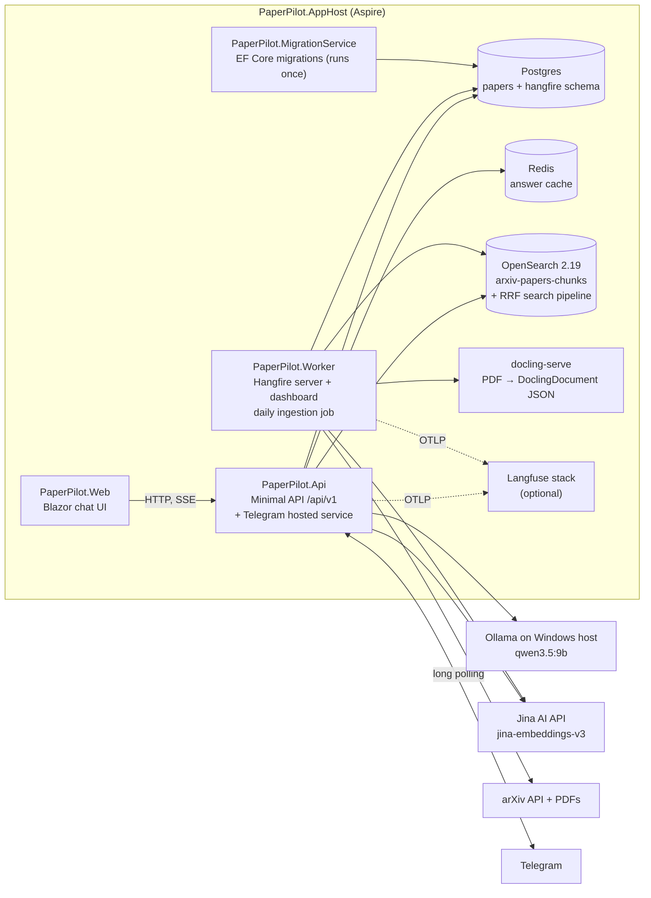

# PaperPilot: implementation plan

PaperPilot is a C# / .NET 10 arXiv CS.AI paper curator with hybrid search, classic RAG and agentic RAG. It matches an existing Python implementation feature for feature; "the Python version", "the Python repo" and "the Python stack" in these files refer to that implementation. This folder (`docs/plan/`) holds the plan.

| File | What it covers |
|---|---|
| [README.md](README.md) | Decisions, target architecture, solution layout, packages, configuration, conventions, risks, definition of done |
| [python-to-dotnet-map.md](python-to-dotnet-map.md) | Each Python file and the C# file or package that replaces it |
| [behaviour-changes.md](behaviour-changes.md) | Bugs fixed during the port and other deliberate differences from the Python version (IDs `B1`, `C1`, ...) |
| [phase-0-bootstrap.md](phase-0-bootstrap.md) | Repo, solution, Aspire AppHost, infrastructure containers |
| [phase-1-domain-persistence.md](phase-1-domain-persistence.md) | Options, domain models, EF Core + migrations |
| [phase-2-search.md](phase-2-search.md) | OpenSearch index and pipeline, Jina embeddings, `/hybrid-search`, `/health`, seeding |
| [phase-3-classic-rag.md](phase-3-classic-rag.md) | Ollama via `IChatClient`, prompts, Redis cache, `/ask`, `/stream`, OpenTelemetry to Langfuse, `/feedback` |
| [phase-4-ingestion.md](phase-4-ingestion.md) | arXiv client, docling-serve, chunker, indexer, Hangfire daily job |
| [phase-5-agentic-rag.md](phase-5-agentic-rag.md) | Microsoft Agent Framework workflow, `/ask-agentic` |
| [phase-6-telegram.md](phase-6-telegram.md) | Telegram bot |
| [phase-7-blazor-ui.md](phase-7-blazor-ui.md) | Blazor chat UI |
| [phase-8-hardening.md](phase-8-hardening.md) | Parity checks against Python, CI, docs, cleanup |

Last updated 2026-10-02 (D13–D15 added at the start of phase 0).

---

## 1. Decisions

| # | Decision | Choice | Notes |
|---|---|---|---|
| D1 | Scope | **The finished Python system only** | Its notebooks and intermediate versions aren't ported. Phases follow dependencies. |
| D2 | Location | **New standalone repo `PaperPilot`** | For example `D:\ai_workspace\PaperPilot`, pushed to `github.com/arunmariappan/PaperPilot`. Work happens on `main`; no feature branches. |
| D3 | Runtime | **.NET 10 (LTS), C# 14** | Pin the SDK in `global.json`. |
| D4 | Local orchestration | **Aspire AppHost (Aspire 13.x)** | Replaces `compose.yml`. The Aspire dashboard shows logs, traces and metrics. |
| D5 | Agent graph | **Microsoft Agent Framework 1.x Workflows** | Replaces LangGraph. Package `Microsoft.Agents.AI.Workflows`. |
| D6 | Ingestion scheduler | **Hangfire + Hangfire.PostgreSql** | Replaces Airflow. Weekdays 06:00 UTC, with a dashboard. |
| D7 | UI | **Blazor Web App (Interactive Server)** | Replaces Gradio. |
| D8 | Python bugs | **Fix while porting** | Each fix is listed in [behaviour-changes.md](behaviour-changes.md). |
| D9 | API contract | **Same routes and snake_case JSON as Python** | Routes are `/api/v1/health`, `/hybrid-search/`, `/ask`, `/stream`, `/ask-agentic`, `/feedback`. Request and response shapes stay the same apart from the listed changes. *This is an assumption; change it here if you want a different contract.* |
| D10 | PDF parsing | **docling-serve container** | Docling only exists in Python, so it runs as a REST sidecar. `UglyToad.PdfPig` handles page-count validation. |
| D11 | Ollama | **Your Windows host Ollama** (default `qwen3.5:9b`, `Think=false`) | Aspire runs the .NET projects on the host, so they reach `http://localhost:11434` directly and `host.docker.internal` isn't needed. An Ollama container is optional. |
| D12 | Observability | **OpenTelemetry** | Traces go to the Aspire dashboard always, and to Langfuse over OTLP/HTTP when it's enabled. There's no Langfuse .NET SDK, and none is needed. |
| D13 | Langfuse storage | **Shares the main Postgres server, has its own Redis** | A `langfuse` database on the main Postgres saves most of the memory. Langfuse's job queues need Redis `maxmemory-policy noeviction`, while the answer cache uses `allkeys-lru`, so Langfuse gets a small `langfuse-redis` of its own (as in Python's compose). |
| D14 | Blank queries | **Rejected with 400** | `AskRequest.Query` must contain a non-whitespace character (C13). |
| D15 | License | **Apache-2.0** | Chosen when the GitHub repo was created. |

### Goals
- Match the Python version feature for feature: ingestion (arXiv → PDF → Docling → Postgres → chunk → embed → OpenSearch), every `/api/v1` endpoint, classic and agentic RAG, Redis answer cache, Telegram bot, tracing, user feedback and a chat UI.
- Start the whole stack with one command: `aspire run`, or `dotnet run --project src/PaperPilot.AppHost`.
- Have tests that actually catch regressions, unlike the Python router tests that accept 500.

### Non-goals
- The Python repo's Jupyter notebooks.
- Sharing Redis cache keys or a database with the Python stack. The two are independent.
- Production deployment (Kubernetes, Azure). Aspire can publish later (`aspire publish` to Docker Compose), but that isn't in scope.
- Authentication. The Python API has none, and PaperPilot adds none.

---

## 2. Target architecture



**Runtime processes**
- **PaperPilot.Api**: every `/api/v1` endpoint, plus the Telegram bot as a `BackgroundService`. It runs in the same process, as it does in Python.
- **PaperPilot.Worker**: an ASP.NET Core host for the Hangfire server and the dashboard at `/hangfire`. It runs the daily ingestion job and also offers a manual backfill endpoint.
- **PaperPilot.Web**: the Blazor UI. It finds the API through Aspire service discovery.
- **PaperPilot.MigrationService**: applies EF Core migrations and exits. Api and Worker wait for it with `WaitForCompletion`.

**Dependency direction** (no cycles):

```
Core  ←  Infrastructure  ←  Rag, Ingestion  ←  Api, Worker, MigrationService
                                              ←  Web (calls Api over HTTP only)
ServiceDefaults ← every host
```

---

## 3. Solution layout

```
PaperPilot/
├── PaperPilot.slnx
├── global.json                      # pins the .NET 10 SDK
├── Directory.Build.props            # net10.0, Nullable, ImplicitUsings, TreatWarningsAsErrors, analyzers
├── Directory.Packages.props         # central package management; every version is pinned here
├── .editorconfig
├── README.md, CLAUDE.md
├── docs/plan/                       # this plan
├── src/
│   ├── PaperPilot.AppHost/          # Aspire: containers, projects, parameters, secrets
│   ├── PaperPilot.ServiceDefaults/  # OTel (+ Langfuse exporter), health checks, resilience defaults, service discovery
│   ├── PaperPilot.Core/             # no I/O: options, domain, contracts, TextChunker, QueryBuilder, prompts, cache key
│   ├── PaperPilot.Infrastructure/   # all I/O: EF Core, OpenSearch, Jina, Ollama, Redis, arXiv, docling, Langfuse scores
│   ├── PaperPilot.Rag/              # classic RagService + Agentic/ (Agent Framework workflow)
│   ├── PaperPilot.Ingestion/        # PaperFetchService, HybridIndexer, DailyIngestionJob (library, no host)
│   ├── PaperPilot.MigrationService/
│   ├── PaperPilot.Api/              # Endpoints/, Telegram/, Program.cs
│   ├── PaperPilot.Worker/           # Hangfire host
│   └── PaperPilot.Web/              # Blazor
└── tests/
    ├── PaperPilot.UnitTests/        # pure logic + parity fixtures from Python
    ├── PaperPilot.IntegrationTests/ # Testcontainers + WebApplicationFactory
    └── fixtures/python-parity/      # JSON/XML produced by the Python code (see phase 2 and phase 4)
```

---

## 4. Packages

Pin every version in `Directory.Packages.props` and use the latest stable release when you start each phase. Major lines current as of Oct 2026: Aspire 13.x, Microsoft Agent Framework 1.x, EF Core 10, Hangfire 1.8.x.

| Concern | Package(s) | Replaces (Python) |
|---|---|---|
| Orchestration | `Aspire.AppHost.Sdk`, `Aspire.Hosting.PostgreSQL`, `Aspire.Hosting.Redis`, `CommunityToolkit.Aspire.Hosting.Ollama` (optional container) | docker compose |
| Client integrations | `Aspire.Npgsql.EntityFrameworkCore.PostgreSQL`, `Aspire.StackExchange.Redis`, `CommunityToolkit.Aspire.OllamaSharp` | factories + `lru_cache` |
| Web API | `Microsoft.AspNetCore.OpenApi` (built in), `Scalar.AspNetCore` (API docs UI at `/docs`) | FastAPI, Swagger UI |
| Persistence | `Npgsql.EntityFrameworkCore.PostgreSQL`, `EFCore.NamingConventions` (snake_case columns), `Microsoft.EntityFrameworkCore.Design` | SQLAlchemy, psycopg2, (unused) Alembic |
| LLM | `OllamaSharp` (implements `IChatClient`), `Microsoft.Extensions.AI` | langchain-ollama, httpx |
| Agent | `Microsoft.Agents.AI.Workflows` | LangGraph, LangChain |
| Embeddings | typed `HttpClient` (no SDK) | httpx |
| Search | typed `HttpClient` + `System.Text.Json.Nodes` | opensearch-py |
| Cache | `StackExchange.Redis` (through the Aspire client) | redis-py |
| HTTP resilience | `Microsoft.Extensions.Http.Resilience` | hand-rolled retry loops |
| Rate limiting | `System.Threading.RateLimiting` (in the BCL) | `asyncio.sleep` |
| PDF validation | `UglyToad.PdfPig` | pypdfium2 |
| PDF parsing | **docling-serve** container (`ghcr.io/docling-project/docling-serve-cpu:v1.35.0`) | docling |
| Scheduling | `Hangfire.Core`, `Hangfire.AspNetCore`, `Hangfire.PostgreSql` | Airflow 2.10 |
| Telemetry | `OpenTelemetry.Extensions.Hosting`, `OpenTelemetry.Exporter.OpenTelemetryProtocol`, ASP.NET/HTTP instrumentation (from ServiceDefaults) | langfuse SDK v3 |
| Telegram | `Telegram.Bot` | python-telegram-bot |
| UI | Blazor (in the framework), `Markdig` (render answers as Markdown) | Gradio |
| Tests | `xunit.v3`, `NSubstitute`, `Shouldly`, `Microsoft.AspNetCore.Mvc.Testing`, `Testcontainers.PostgreSql`, `Testcontainers.Redis`, `Testcontainers` (generic, for OpenSearch), `WireMock.Net`, `Aspire.Hosting.Testing` (smoke test), `bunit` (optional UI component tests) | pytest, testcontainers, pytest-mock |
| Quality | Nullable reference types, `TreatWarningsAsErrors`, built-in analyzers, `dotnet format` | ruff (imports only), mypy (`ignore_errors`) |

`sentence-transformers`, `langchain-community`, `grandalf` and `alembic` were never used in a way that needs porting.

---

## 5. Configuration

Options classes live in `PaperPilot.Core/Options` and bind from `appsettings.json` sections. Each has `ValidateDataAnnotations().ValidateOnStart()`, so bad configuration fails at startup, like the pydantic validators did.

> **Correction to earlier advice:** .NET maps `OPENSEARCH__HOST` to section `OPENSEARCH`, key `HOST`, case-insensitively. That works. But `OPENSEARCH__INDEX_NAME` gives the key `INDEX_NAME`, which does **not** bind to a property named `IndexName`. So PaperPilot uses .NET-style names (`OpenSearch__IndexName`) instead of the Python `.env` names.

| Python env var | PaperPilot key | Source |
|---|---|---|
| `POSTGRES_DATABASE_URL` | `ConnectionStrings:papers` (Npgsql format) | injected by Aspire (`WithReference(db)`) |
| `REDIS__HOST/PORT/PASSWORD/DB` | `ConnectionStrings:redis` | injected by Aspire |
| `REDIS__TTL_HOURS` | `Cache:TtlHours` (6) | appsettings |
| `OPENSEARCH__HOST` | `OpenSearch:Host` | Aspire `WithEnvironment(..., opensearch.GetEndpoint("http"))` |
| `OPENSEARCH__INDEX_NAME`, `CHUNK_INDEX_SUFFIX`, `VECTOR_DIMENSION`, `VECTOR_SPACE_TYPE`, `RRF_PIPELINE_NAME`, `HYBRID_SEARCH_SIZE_MULTIPLIER` | `OpenSearch:IndexName`, `ChunkIndexSuffix`, `VectorDimension`, `VectorSpaceType`, `RrfPipelineName`, `HybridSearchSizeMultiplier` | appsettings |
| `OLLAMA_HOST` | `ConnectionStrings:ollama` = `Endpoint=http://localhost:11434` | AppHost `AddConnectionString("ollama")` |
| `OLLAMA_MODEL`, `OLLAMA_TIMEOUT`, `OLLAMA_THINK` | `Ollama:Model` (`qwen3.5:9b`), `Ollama:TimeoutSeconds` (300), `Ollama:Think` (false) | appsettings |
| `JINA_API_KEY` | `Jina:ApiKey` | **secret** AppHost parameter (user-secrets) |
| `ARXIV__*` | `Arxiv:BaseUrl`, `PdfCacheDir`, `RateLimitDelaySeconds`, `TimeoutSeconds`, `MaxResults`, `SearchCategory`, `DownloadMaxRetries`, `DownloadRetryDelayBaseSeconds`, `MaxConcurrentDownloads`, `MaxConcurrentParsing` | appsettings |
| `PDF_PARSER__*` | `PdfParser:MaxPages` (30), `MaxFileSizeMb` (20), `DoOcr` (false), `DoTableStructure` (true) | appsettings |
| (new) | `Docling:BaseUrl`, `Docling:TimeoutSeconds` (600) | Aspire endpoint / appsettings |
| `CHUNKING__*` | `Chunking:ChunkSize` (600), `OverlapSize` (100), `MinChunkSize` (100), `SectionBased` (true), plus new `SectionMinWords` (100), `SectionMaxWords` (800) | appsettings |
| `LANGFUSE__PUBLIC_KEY/SECRET_KEY/HOST` | `Langfuse:PublicKey`, `Langfuse:SecretKey`, `Langfuse:BaseUrl`, `Langfuse:Enabled` | **secret** AppHost parameters |
| `TELEGRAM__BOT_TOKEN/ENABLED` | `Telegram:BotToken`, `Telegram:Enabled` | **secret** AppHost parameter |
| `APP_VERSION`, `ENVIRONMENT`, `SERVICE_NAME` | `App:Version`, `ASPNETCORE_ENVIRONMENT`, `App:ServiceName` | appsettings |

Secrets go into the AppHost's user-secrets (`dotnet user-secrets set Parameters:jina-api-key ...`) and are never committed. Never paste them into chat either.

---

## 6. Conventions

- **Commits:** on `main`, small and one per task, using conventional prefixes (`feat:`, `fix:`, `test:`, `chore:`).
- **Async all the way down:** every I/O method takes a `CancellationToken`. No `.Result` or `.Wait()`.
- **JSON:** `JsonSerializerOptions` uses `JsonNamingPolicy.SnakeCaseLower` for the public API, so the wire format matches Python (`top_k`, `use_hybrid`, `chunks_used`). Use `[JsonPropertyName("from")]` for the reserved word.
- **No silent failures:** `OpenSearchClient` throws, and callers decide whether to degrade (see `B6`). Every catch-and-degrade logs at Warning or Error and tags the current `Activity` with the error.
- **Non-raising LLM fallbacks stay:** guardrail returns 50, grading uses the length heuristic, rewrite appends keywords, generate returns an error message. Small local models often produce invalid JSON.
- **Prompts** are embedded resources (`.txt`) in `PaperPilot.Rag/Prompts`, copied verbatim from Python.
- **Time:** always UTC, stored as `timestamptz`. Npgsql rejects `DateTimeKind.Unspecified`.
- **Tests:** each phase ships its own tests. Router tests assert exact status codes (no `in [200, 500, 503]`).

---

## 7. Phase overview

| Phase | Outcome | Size | Depends on |
|---|---|---|---|
| [0 Bootstrap](phase-0-bootstrap.md) | `aspire run` brings up Postgres, Redis, OpenSearch, docling-serve, (Langfuse); empty projects build | M | none |
| [1 Domain & persistence](phase-1-domain-persistence.md) | Options, domain models, `papers` table via EF migration | S | 0 |
| [2 Search](phase-2-search.md) | Index + RRF pipeline bootstrap, Jina client, `/hybrid-search/`, `/health`; seeded with the Python index's data | M | 1 |
| [3 Classic RAG](phase-3-classic-rag.md) | `/ask`, `/stream`, Redis cache, OTel traces in Aspire + Langfuse, `/feedback` | M | 2 |
| [4 Ingestion](phase-4-ingestion.md) | Hangfire daily job: arXiv → docling-serve → Postgres → chunks → OpenSearch; run summaries | L | 2 |
| [5 Agentic RAG](phase-5-agentic-rag.md) | Agent Framework workflow, `/ask-agentic` | L | 3 |
| [6 Telegram](phase-6-telegram.md) | Bot with `/start`, `/help`, `/search`, free-text Q&A | S | 3 |
| [7 Blazor UI](phase-7-blazor-ui.md) | Chat page: streaming classic answers, agentic mode, sources, feedback | M | 3, 5 |
| [8 Hardening](phase-8-hardening.md) | Parity report against Python, CI, docs, cleanup | M | all |

Phases 4 and 5 are independent and can be done in either order. Phase 2 seeds OpenSearch from the Python stack's index, so search and RAG can be tested on real data before ingestion is ported.

---

## 8. Top risks

| # | Risk | Mitigation | Where |
|---|---|---|---|
| R1 | **Aspire's standard resilience handler** applies to every `HttpClient` with a ~30 s total timeout. Ollama generation, docling parsing and Jina back-off all take longer. | Replace the standard handler on those named clients with their own timeouts and retry policies. Spike this in phase 0. | 0, 3, 4 |
| R2 | **Docker Desktop has 8 GB.** OpenSearch, docling-serve (~2 GB) and the Langfuse stack (ClickHouse, MinIO, ...) together are tight. | Cap the OpenSearch heap at 512 MB. Make Langfuse optional (an AppHost parameter or explicit start), and let it share the main Postgres (D13). The Aspire dashboard covers tracing without it. | 0 |
| R3 | **docling-serve sync timeout and JSON schema drift** | Pin the image tag. Raise `DOCLING_SERVE_MAX_SYNC_WAIT` or use the async endpoints. Parse only `texts[].label/text` and `text_content`. Keep a recorded fixture. | 4 |
| R4 | **Agent Framework Workflows API detail** (it's 1.x, but the workflow surface is newer than the agent surface) | Hide it behind `IAgenticRagService`. Build a spike first in phase 5 and check the exact API names against the 1.x docs. | 5 |
| R5 | **OllamaSharp mapping of `think` and structured output** through `IChatClient` | Phase 3 spike: check that `Think=false` reaches Ollama and that `GetResponseAsync<T>()` returns JSON that matches the schema. If it doesn't, set the raw `ChatRequest` through `ChatOptions.RawRepresentationFactory`. | 3 |
| R6 | **Langfuse OTel mapping** (generation vs span, trace id format, scores) | Phase 3 spike: one traced `/ask`, confirm it shows up with input, output and token usage, then post a score against its trace id. | 3 |
| R7 | **Hangfire.PostgreSql invisibility timeout** (default 30 min): a long ingestion run can get picked up a second time | Raise `InvisibilityTimeout` (e.g. 3 h) and add `[DisableConcurrentExecution]`. | 4 |
| R8 | Snake_case env var names don't bind to PascalCase options | Use .NET-style keys (§5). | 1 |

---

## 9. Definition of done (whole project)

- [ ] `aspire run` starts everything, and the Aspire dashboard shows every resource as healthy (Langfuse only when enabled).
- [ ] Triggering `arxiv-daily-ingestion` from the Hangfire dashboard stores papers in Postgres, indexes chunks in OpenSearch, and writes an `ingestion_runs` row whose counts match `_count`.
- [ ] `/api/v1/health`, `/hybrid-search/`, `/ask`, `/stream`, `/ask-agentic` and `/feedback` behave as described in their phase docs, and any differences from Python are only those in [behaviour-changes.md](behaviour-changes.md).
- [ ] The Telegram bot answers questions and `/search`.
- [ ] The Blazor UI streams classic answers, shows agentic reasoning steps and sources, and sends feedback.
- [ ] Traces show up in the Aspire dashboard, and in Langfuse with feedback scores attached.
- [ ] Unit and integration tests pass in GitHub Actions, and `dotnet format --verify-no-changes` is clean.
- [ ] A parity report (phase 8) compares PaperPilot with the Python stack on a fixed query set.
