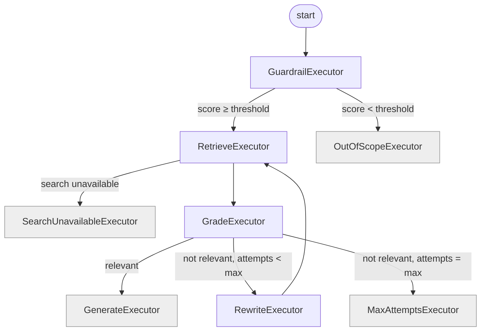

# Phase 5: Agentic RAG with Microsoft Agent Framework

**Goal:** `POST /api/v1/ask-agentic` runs the guardrail → retrieve → grade → (rewrite → retrieve)* → generate graph as a Microsoft Agent Framework workflow. It keeps every non-raising LLM fallback and returns `AgenticAskResponse` with sources, reasoning steps and a `trace_id` usable with `/feedback`.

**Size:** L · **Depends on:** phase 3 (`IChatClient`, `PaperRetriever`, tracing)

## Behaviour that must be preserved

From `services/agents/**` and `routers/agentic_ask.py`:

| Setting | Value |
|---|---|
| `max_retrieval_attempts` | 2 |
| `guardrail_threshold` | 60 (continue when `score >= 60`) |
| Temperatures | guardrail 0.0, grading 0.0, rewrite 0.3, generate 0.0 |
| `top_k` / `use_hybrid` / model | from the request (**B2**); defaults 3 / true / `Ollama:Model` |

| Node | Behaviour | Non-raising fallback |
|---|---|---|
| guardrail | `GUARDRAIL_PROMPT` → structured `GuardrailScoring { score: 0..100, reason }` | `score = 50`, reason "LLM validation failed, using conservative default: …". With threshold 60 this routes to **out of scope**; keep that. |
| out_of_scope | Fixed message, verbatim from `out_of_scope_node.py`, including `Your question: '{question}'` | none (no LLM) |
| retrieve | `attempts += 1`, then retrieve with the **current** query (original, or rewritten after a rewrite) | B3: BM25 if embedding fails |
| grade_documents | No context → rewrite. Otherwise `GRADE_DOCUMENTS_PROMPT` → `GradeDocuments { binary_score: "yes" or "no", reasoning }` | heuristic `context.Trim().Length > 50`, reasoning "Fallback heuristic (LLM failed): …" |
| rewrite_query | `REWRITE_PROMPT` with the **original** question → `QueryRewriteOutput { rewritten_query, reasoning }`, rejected if blank | `"{original} research paper arxiv machine learning"` |
| generate_answer | `GENERATE_ANSWER_PROMPT` with context (or `"No relevant documents found."`) | `"I apologize, but I encountered an error while generating the answer: {e}\n\nPlease try again or rephrase your question."` |
| max attempts | Fixed message, verbatim from `retrieve_node.py` ("I apologize, but I couldn't find relevant research papers after {n} attempts. …") | none |

- **Reasoning steps:** keep the strings word for word: `Validated query scope (score: {s}/100)`, `Retrieved documents ({n} attempt(s))`, `Graded documents ({k} relevant)`, `Rewritten query for better results`, and as the last step `Generated answer from context`. Python appended that last one even for out-of-scope and max-attempts endings. PaperPilot uses `Responded as out of scope`, `Stopped after {n} retrieval attempts` or `Search was unavailable` for those (**B28**).
- **Errors:** an empty or whitespace query → 400 (C1, C13; Python raised `ValueError` → 422). Anything unexpected → 500 with detail.
- **Tracing:** root span `agentic_rag_request` with metadata `{env, service: "agentic_rag", top_k, use_hybrid, model}`, user `api_user`. Child spans `guardrail_validation`, `document_retrieval_initiation`, `document_grading`, `query_rewriting`, `answer_generation`, each with the same input/output payloads Python logged. `trace_id` in the response.

## Fixes applied in this phase
B1 (sources filled in), B2 (request options honoured, real `chunks_used` and `search_mode`), B3 (BM25 fallback), B4 (clean context formatting), B5 (no wasted rewrite), B6 (search outage → explicit answer), C10 (direct retrieval, no synthetic tool call), and two new ones:
- **B27:** grading and answer generation use the user's **original** question. Python used the latest message, so after a rewrite the user got an answer to the *rewritten* question. The rewritten query is still used for retrieval.
- **B28:** the final reasoning step reflects how the run actually ended (see above).

## Target workflow

Terminal executors yield the final `AgentRunState` as the workflow output.

## Tasks

### 5.1 Spike (R4), half a day, before anything else
- [x] A throwaway console app (`dotnet run spike.cs`) with `Microsoft.Agents.AI.Workflows`. It has three executors passing a record, a conditional edge, a loop back edge, and a terminal executor that yields output. It runs in-process and reads the output event.
- [x] Settle these and write them in `CLAUDE.md`: the executor base type and handler signature, how conditional edges are declared (`AddEdge(source, target, condition)` or a switch), how output is yielded and read, whether a built `Workflow` can be **reused** across concurrent runs (if not, build one per request), how cancellation flows, and what OTel spans the framework emits by itself.

### 5.2 Types (`PaperPilot.Rag/Agentic`)
- [x] `AgenticRagOptions` (bound from `Agentic` config): `MaxRetrievalAttempts`, `GuardrailThreshold`, temperatures.
- [x] `AgentRunState` (immutable record, updated with `with`): `OriginalQuestion`, `CurrentQuery`, `Model`, `TopK`, `UseHybrid`, `Categories`, `Guardrail?`, `RetrievalAttempts`, `LastRetrieval?` (`RetrievalResult`), `Gradings` (list), `RewrittenQuery?`, `Answer?`, `Ending?` (`Answered | OutOfScope | MaxAttempts | SearchUnavailable`).
- [x] Structured-output records: `GuardrailScoring`, `GradeDocuments`, `QueryRewriteOutput`, `GradingResult`.
- [x] Prompts as embedded `.txt` files, copied verbatim: `guardrail.txt`, `grade_documents.txt`, `rewrite.txt`, `generate_answer.txt`. Use `{question}` / `{context}` placeholders with simple replacement (no `string.Format`, so braces in paper text can't break anything).
- [x] `AgentContextFormatter.Format(RetrievalResult)` → `[n] arXiv:{id} — {title}\n{chunk_text}` blocks (B4).

### 5.3 Executors (`PaperPilot.Rag/Agentic/Executors`)
- [x] One class per node in the table, plus `MaxAttemptsExecutor` and `SearchUnavailableExecutor`. Each one starts its named `Activity`, calls the LLM through `IChatClient.GetResponseAsync<T>(prompt, options)` (structured output) or `PaperRetriever`, applies its fallback on **any** exception or invalid value (e.g. a score outside 0–100), and returns the updated state.
- [x] Executors are stateless. Services come from DI, and per-request values come from the state.

### 5.4 Workflow and service
- [x] `AgenticRagWorkflowFactory.Build()` wires the edges from the diagram with `WorkflowBuilder`. **As built:** `AgenticRagWorkflow`, which builds the graph in its constructor and also runs it (see As built).
- [x] `AgenticRagService : IAgenticRagService`, method `AskAsync(AskRequest, CancellationToken)` → `AgenticAskResponse`:
  - Validate the query, build the initial state (B2 defaults), start `agentic_rag_request`, run the workflow in-process, and read the output state.
  - `answer` = `state.Answer`. `sources` = de-duplicated `ArxivId.ToPdfUrl` from `LastRetrieval` when the ending is `Answered`, otherwise `[]` (B1). `chunks_used` = number of chunks in `LastRetrieval` (B2). `search_mode` = `LastRetrieval.SearchMode`, or the requested mode if retrieval never ran. `reasoning_steps` per the rules above. `retrieval_attempts`, `trace_id`.
- [x] Keep the Agent Framework types behind `IAgenticRagService`, so a framework API change only touches `PaperPilot.Rag/Agentic`.

### 5.5 Endpoint
- [x] `POST /api/v1/ask-agentic` → `IAgenticRagService.AskAsync`. The input contract is the same `AskRequest`.

## As built

- **Agent Framework 1.23** (`Microsoft.Agents.AI.Workflows`). The spike's answers are in `CLAUDE.md`. In short:
  - Nodes are `Executor<AgentRunState, AgentRunState>`; the four endings are `Executor<AgentRunState>` with `[YieldsOutput]`.
  - Edges are `AddEdge<T>(from, to, predicate)`, with predicates in `AgentRouting`.
  - One workflow is built at startup and shared. That needs `InProcessExecution.Concurrent` and executors declared
    cross-run shareable; the default environment refuses a second concurrent run.
- **`AgenticRagWorkflow`** replaces the planned `AgenticRagWorkflowFactory`: it builds the graph in its constructor and
  runs it, so every framework type stays in that one class. A node's unhandled exception arrives as an
  `ExecutorFailedEvent` rather than being thrown, so the class rethrows the original exception. A cancelled run returns
  normally, so it checks the token afterwards.
- **Spans.** The framework's own spans (`WithOpenTelemetry`) stay off: they add `workflow.session`, `workflow_invoke`,
  `executor.process`, `message.send` and `edge_group.process`, several per node. `Activity.Current` flows into the
  handlers, so the node spans with Python's names nest directly under `agentic_rag_request`.
  - Payloads are Python's, with two exceptions. The retrieval span reports `status: "retrieved"` (plus
    `chunks_retrieved` and `search_mode`) instead of `tool_call_created`, since there is no tool call (C10). Grading's
    `routing_decision` can also be `max_attempts` (B5).
  - Metadata goes in `langfuse.trace.metadata.{key}` and `langfuse.observation.metadata.{key}` attributes. Fallbacks set
    `langfuse.observation.level`: `WARNING` for the guardrail, grading and rewrite, `ERROR` for generation and a search
    outage.
  - The terminal nodes without an LLM call have no span, as in Python.
- **Structured output.** `GetResponseAsync<T>` sends a JSON schema (Ollama's `format`) with Python's snake_case field
  names, and `binary_score` is an enum, `yes` or `no`. A missing or null required field is an error, as with pydantic,
  so the node falls back instead of reading a default 0 or null. The guardrail also falls back on a score outside
  0–100.
- **Where things live:** `AgenticRagOptions` is in `PaperPilot.Core/Options` with the other options classes. The four
  prompts are in `PaperPilot.Rag/Prompts`, next to `rag_system.txt`.
- **Python fixtures:**
  - `agentic/prompts.json` has the four prompts filled by `str.format`, including a question with braces and a paper
    that contains `{question}`.
  - `agentic/fallbacks.json` comes from running Python's nodes against a failing LLM: the guardrail reason, the grading
    heuristic's reasoning, the rewrite fallback, the generation error, and the out-of-scope and max-attempts answers.
    Golden tests compare all of them.
- **Found while porting:**
  - Python's reasoning step `Graded documents ({k} relevant)` counted only the latest grading, and disappeared when
    the last retrieval found nothing. PaperPilot counts every graded retrieval (added to B28).
  - `trace_id` is returned even when Langfuse is off (C14).

## Tests
- [x] Unit (scripted `FakeChatClient` that routes on the prompt's first line, plus a fake `IPaperRetriever`):
  - out of scope (score 20) → out-of-scope message, 0 attempts, retriever never called, last step `Responded as out of scope`
  - relevant on the first try → 1 attempt, sources filled in, `chunks_used` = retrieved count
  - irrelevant twice → exactly **one** rewrite call (B5), 2 attempts, max-attempts message
  - irrelevant then relevant → second retrieval uses the rewritten query, and the generate prompt contains the **original** question (B27)
  - each LLM failure → its fallback (guardrail 50 → out of scope; grading heuristic; rewrite keywords; generate error text)
  - embedding failure → BM25 (B3); search outage → `SearchUnavailable` ending
  - request `top_k: 5`, `model: "x"` reach the retriever and `ChatOptions.ModelId` (B2)
  - reasoning-step strings match exactly
- [x] Integration: `/ask-agentic` with WireMock standing in for Ollama (scripted JSON for each prompt): 200 shape, `trace_id` is 32 hex characters, 400 on an empty query.

## Done when
- [x] "What are transformer architectures?" → in scope, relevant, answer with `[arXiv:…]` citations, non-empty `sources`. *Checked 2026-10-03:* score 95, relevant on the first retrieval, an answer citing arXiv:2610.00820v1 and arXiv:2610.00791v1, two sources. It took 3 min 41 s because Ollama was about four times slower than during phase 3 that day: a classic `/ask` took 1 min 47 s instead of 25 s.
- [x] "What is 2+2?" → out-of-scope message, no retrieval. *Checked:* score 0, Python's message, 16 s.
- [x] A query with no matching papers → one rewrite, then the max-attempts message. *Checked twice.* With a category no paper has, both retrievals came back empty, so there was no grading call, and the second retrieval used the rewrite. An off-corpus question about B-tree page splitting was graded "no" twice, with one rewrite in between.
- [x] The Aspire dashboard shows the node spans in order, and Langfuse (when enabled) shows the same tree with each LLM call as a generation. *Checked:* `agentic_rag_request` → `guardrail_validation` → `document_retrieval_initiation` (with `query_embedding` and `search_retrieval`) → `document_grading` → `answer_generation`. In Langfuse each `chat qwen3.5:9b` is a generation with token usage, and the trace and node spans carry their metadata.
- [x] `/feedback` with the returned `trace_id` attaches a score in Langfuse. *Checked:* `user-feedback` = 1 on the trace.
